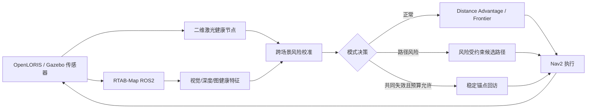

# 主动 SLAM 选题阶段报告（2026-08-13 22:50 检查版）

## 一句话结论

目前最值得继续、但尚未最终锁题的方向是：

> **面向 RGB-D–二维激光互补退化的主动 SLAM 校准式选择性恢复**

核心不是再做一个“信息增益 + 距离 + 不确定度”的加权函数，而是解决一个可被实验闭环检验的问题：当 RGB-D 视觉与二维激光具有互补退化时，机器人怎样判断“继续探索、绕开高风险路径、还是回访稳定锚点”，并显式限制错误恢复和绕行代价。

这只是当前工作方向，不是已经证实的新颖性结论。若公开真实数据不能证明健康指标具有跨场景预测力，或者恢复预算下闭环收益消失，应停止该方法路线，转为“互补传感器退化下的 ROS2 主动 SLAM 可复现实验基准 + 简单失败感知基线”。

## 1. 为什么不沿用旧 NBV 代码

仓库根目录的 NBV/HNBV 实现是 AI 构建的复现脚手架，原论文没有官方代码，不能承担基线可信度、实现正确性和创新性判断。因此已建立独立目录 `active_slam_research/`，旧代码只允许作为工具参考，不作为论文证据或代码底座。

## 2. 文献综合后的客观边界

本阶段优先核验了 IEEE T-RO、IEEE RA-L、Robotics and Autonomous Systems、ICRA、IROS 等来源中的主动 SLAM、感知感知规划、主动回环和不确定性表示工作。完整证据矩阵见 `literature/evidence_matrix.md`。

### 已经被充分占据的贡献

1. **通用主动 SLAM 框架和信息目标**：2023 年 T-RO 综述已经把系统分解为动作生成、效用计算和动作执行，并明确指出复现、统一基准与真实部署仍是缺口。仅换一个不确定性权重不是创新。
2. **视觉可定位性规划**：FIT-SLAM/FIT-SLAM 2、Yu 等人的特征受限飞行规划、Help Me Through，以及 2026 年 Shi 等人的预印本，已经覆盖视觉 Fisher 信息、特征可见性、主动视角和视觉跟踪失败规避。
3. **激光退化感知规划**：LF-3PM 已使用激光退化/可定位性指导拓扑和姿态规划，虽然是三维激光与 UAV/高性能栈。
4. **主动回环与稳定化**：Loop-Aware Exploration Graph、Lighthouses、Probabilistic Active Loop Closure 已证明回访和图稳定化是成熟研究问题；IROS 2020 ARAS 更进一步使用多假设状态/地图主动探索和回环消歧；2025 Region-Based SLAM-Aware Exploration 预印本已做室内分区稳定化、关键帧边缘化和失败检查点。因此“鲁棒主动恢复/稳定区域回访”本身也不是空白。
5. **健康感知/互补多传感器估计**：LOCUS 已做健康感知的多传感器里程计融合；2025 CompSLAM 也明确以视觉、热成像、深度、惯性、运动学和可选激光的互补冗余应对地下退化环境。把“传感器互补/健康”用于估计器本身不是新概念。
6. **泛化的自适应加权**：近期不确定度地图、B-ActiveSEAL 和自适应信息目标已使“动态调整探索/定位权重”这一宽泛表述非常拥挤。

### 当前仍可检验的窄缺口

在已检查语料和精确检索式中，尚未找到同时满足以下条件的同行评审系统：

- 室内轮式地面机器人；
- RGB-D/相机与二维激光的模态特定在线健康度；
- 区分单模态退化、互补退化和共同失效；
- 健康度直接改变 frontier/path/revisit 行为；
- 对不必要恢复和额外路径设置显式代价约束；
- 同时使用传感器匹配的公开真实数据和公开闭环环境验证。

严谨表述只能是“当前检索中未找到”，不能写成“世界首次”。最终锁题前仍需通过学校可访问的 IEEE Xplore、Web of Science 或 Scopus 导出检索结果并复核。

## 3. 推荐题目的可检验定义

### 暂定题目

**Calibrated Selective Recovery for Active RGB-D–2D-LiDAR SLAM under Complementary Degradation**

中文可暂译为：**面向 RGB-D–二维激光互补退化的主动 SLAM 校准式选择性恢复**。

### 研究问题

由 RGB-D 跟踪、二维激光扫描匹配和位姿图状态得到的轻量健康分数，能否在未见场景中校准未来短时定位失败风险，并在显式恢复预算下减少主动探索中的定位误差、地图不一致和跟踪失败，而不显著增加完成距离与时间？

### 不能缺少的三个贡献

1. **可校准的健康预测**：不是把特征数、ICP 内点率直接相加，而是用公开数据检验跨场景概率校准、误报率和未来误差预测。
2. **互补失效决策**：一个模态差但另一个健康时不应误恢复；两个模态共同危险时才允许绕行或回访。
3. **恢复代价约束**：把允许的额外距离/时间写入决策约束，报告完整风险—代价 Pareto，而不是只挑一个最好权重。

## 4. 可复用开源模块闭环

- **RTAB-Map ROS2**：BSD-3-Clause，已有 `OdomInfo`/`Info` 消息暴露视觉 matches/inliers/features、ICP 内点率与结构复杂度、协方差、回环和图统计，可先做外部健康监视节点，不修改核心。
- **frontier_exploration_ros2**：Apache-2.0，ROS2 Humble/Jazzy + Nav2，frontier 核心与 ROS 传输分离，适合作为合法工程底座。
- **SLAM Toolbox**：先作为稳定的二维激光/Gazebo 基线；RTAB-Map 再承担跨模态健康输入。
- **FIT-SLAM 2**：只作算法和系统组织参考。仓库未见明确许可证，不能直接复制作为论文底座。

## 5. 数据集和闭环验证分工

### OpenLORIS-Scene：真实数据只验证模块

它与小车传感器最匹配：轮式平台、Intel D435i RGB/深度/IMU、轮速计、二维激光和真值，多场景、多次采集且包含光照、人群和长期变化。适合验证：

- 未来 0.5–2 s 的跟踪失败或误差增长预测；
- AUROC/AUPRC、Brier 分数、ECE、每分钟误报；
- 跨场景训练/校准—测试分离；
- 相机、激光、朴素融合、校准融合的消融。

固定轨迹数据不能验证“如果机器人选了另一条路会怎样”，所以绝不能仅凭 OpenLORIS 声称主动策略有效。

数据许可为 CC BY-ND 4.0；本地派生特征可用于研究，但公开发布修改后的派生数据前需要单独核对 no-derivatives 条款或联系作者。代码工具的 MIT 许可不能替代数据许可。

### ROS2/Gazebo：验证主动闭环

选中的 Apache-2.0 公开基准含 Corridor、Bookstore、Warehouse，使用 Nav2、SLAM Toolbox 和多种 frontier 基线。需要新增受控视觉退化、激光 dropout/FoV/噪声、轮滑及组合退化，并测：覆盖率、距离、时间、ATE/RPE、地图 IoU/一致性、失败、恢复次数和 CPU。

当前主机只有 Ubuntu 20.04 + ROS Noetic、没有 ROS2/Docker，根分区仅约 12 GB 空余；直接安装 Jazzy/Gazebo 或下载 6.7 GB 以上的完整 OpenLORIS 场景风险过高。因此本阶段没有盲目安装大栈或下载数据。

## 6. 最小机制实验：结果与否定性发现

已用公开 ROS2 基准的 Apache-2.0 Corridor SDF 几何构建轻量闭环模拟器，比较 nearest、information gain、distance advantage、visual-risk 和 cross-modal-risk。二维激光健康来自局部点到线扫描匹配 Hessian 的条件性代理；视觉健康区和定位误差均为可审计的合成代理。

这不是 SLAM 性能证据，只能用于淘汰明显不合理的决策逻辑。

### 已修正的两个方法错误

1. 原先逐场景百分位归一化会在所有位置都健康时人为制造“高风险”。现改为跨场景固定尺度。这与 T-RO 2018 关于不确定性表示会改变排序/决策的结论一致。
2. 仅由累计不确定度触发恢复，会在视觉差但激光健康时产生错误回访。现要求当前融合风险也超过门限。

### 10 个配对种子的门控结果

| 场景 | Distance Advantage | 跨模态策略 | 解释 |
|---|---:|---:|---|
| 仅视觉退化 | 56.50 m / RMSE 0.2308 / 0 失败 | 56.50 m / 0.2391 / 0 | 0 次错误回访；误差差异区间跨 0，不能声称更好 |
| 互补退化 | 56.50 m / 0.4229 / 2.4 | 55.25 m / 0.2887 / 0.7 | RMSE 配对变化 95% 区间 `[-0.1866,-0.0802]` m；失败变化也不跨 0 |
| 共同失效（无预算） | 56.50 m / 0.4886 / 3.3 | 70.25 m / 0.3573 / 1.6 | RMSE 改善，但路径 **+24.3%**，超过预设 10–20%门槛；失败区间略跨 0 |

结论：融合风险门控解决了错误恢复，但无约束的锚点回访不合格。阈值扫描显示 0.50–1.25 的结果几乎不变，说明不能靠微调阈值掩盖代价问题；因此加入了显式恢复绕行预算。

预算扫描显示一个离散拐点：预算不超过 12 m 时不允许回访，16 m 时允许一次回访。固定 16 m 后重新运行 10 个种子：共同失效路径为 61.50 m，相对 distance advantage 增加 **8.85%**；RMSE 从 0.4886 降到 0.3791，配对变化 95%区间 `[-0.1781,-0.0420]` m；失败从 3.3 降到 1.9，区间 `[-2.6,-0.2]`。互补退化仍为 55.25 m / 0.2887 / 0.7，单视觉退化仍为 0 次错误恢复。

预算值 16 m 从现在起对后续地图固定，不能逐图重调。该结果使机制免于立即淘汰，但离散的一次锚点行为和合成误差过程仍是明显局限，必须由真实 RTAB-Map 与多地图闭环检验。

## 7. 选题排序与停止条件

1A. **恢复代价受约束的跨模态健康主动 SLAM**：方法上限更高、最匹配硬件和公开数据，但 ARAS、LOCUS 与 CompSLAM 使宽泛创新空间缩小，需通过真实数据健康预测与预算 Pareto 两道门。
1B. **互补视觉—激光退化的可复现 ROS2 主动 SLAM 基准**：与 1A 当前同分，工程风险更低，是方法门失败后的诚实回退；仅做基准可能创新不足，必须加入合理退化模型和多个后端/策略排名变化。
3. **概率主动回环 + 距离优势**：故事清晰，但 ICRA 2024 已占据核心效用，且无官方代码，重实现风险偏高。
4. **不确定性 frontier 停止 + 距离排序**：容易做，但与 2025 RAS UncertaintyMap 过近，组合创新弱。
5. **ROS1 先验图方法移植 ROS2**：依赖先验地图且主要是移植，投入大、论文贡献弱。

### Go / No-Go

- **停止方法路线**：真实数据跨场景预测不优于 RTAB-Map 原始 lost/covariance；或路径/时间增加超过 10–20%而精度收益小/不稳定。
- **转基准路线**：健康预测有效，但闭环收益仅在人工合成条件成立；此时把主要贡献改为公开退化协议、指标和失效排名。
- **继续投稿路线**：至少两个未见场景和三个闭环环境中，校准、失败减少、地图/轨迹误差和代价约束同时成立，并通过视觉-only、激光-only、朴素融合、无恢复等消融。

## 8. 下一阶段执行顺序

1. 完成恢复预算扫描并固定预注册的代价指标；不根据单个最好种子选参数。
2. 写出 OpenLORIS 最小下载/选择性 topic 提取方案，解决 12 GB 磁盘限制。
3. 定义 RTAB-Map `OdomInfo` 到健康特征的 ROS2 消息接口和离线 CSV 格式。
4. 设计第一版跨场景校准实验：一个场景校准、另一个场景测试；先用逻辑回归/等距校准等轻量模型，不做深度网络。
5. 明确 ROS2 运行环境：优先独立 Ubuntu 22.04 + ROS2 Humble 或有足够磁盘的容器环境，不污染当前 ROS Noetic 主机。
6. 只有前两道实验门通过后，才开始完整 ROS2 节点开发和小车实机演示。

## 9. 22:50 后追加：第一道真实数据门为负

已完成 `cafe1-1` 全序列 RTAB-Map RGB-D + 二维激光 ICP 回放：1127 个样本中视觉 inlier ratio、ICP inlier ratio、ICP structural complexity 和 covariance 均非恒定。以未来 1 s 位姿误差增长不少于 0.05 m 为事件，采用时间前 60% 训练、1 s embargo、后段测试，结果如下：

| 模型 | AUROC | AUPRC | Brier | ECE-10 |
|---|---:|---:|---:|---:|
| 事件率常数 | 0.5000 | 0.2238 | 0.1763 | 0.0511 |
| covariance | 0.3698 | 0.1707 | 0.2502 | 0.2766 |
| visual | 0.5138 | 0.2684 | 0.2754 | 0.3041 |
| lidar | 0.4274 | 0.2206 | 0.6525 | 0.6446 |
| cross-modal | 0.3672 | 0.2010 | 0.7402 | 0.7437 |

因此，“瞬时健康指标直接拼接”已被当前真实数据否定，候选 1A 降为黄灯。只允许再检验一次严格因果的时间窗均值、波动、斜率和跨模态分歧，并必须在第二场景跨场景验证；若仍不优于单视觉/covariance，立即停止方法题。详细判决见 `selection_decision_2026-08-13.md`。

## 主要可核验来源

- [Active SLAM survey, IEEE T-RO 2023](https://doi.org/10.1109/TRO.2023.3248510)
- [Uncertainty representation in Active SLAM, IEEE T-RO 2018](https://doi.org/10.1109/TRO.2018.2808902)
- [FIT-SLAM 2, Robotics and Autonomous Systems 2025](https://doi.org/10.1016/j.robot.2025.105188)
- [Help Me Through, IEEE T-RO 2025](https://doi.org/10.1109/TRO.2025.3582817)
- [LOCUS, IEEE RA-L 2021](https://doi.org/10.1109/LRA.2020.3044864)
- [ARAS, IROS 2020](https://www.cs.cmu.edu/~kaess/pub/Hsiao20iros.html)
- [CompSLAM, 2025 workshop/preprint](https://arxiv.org/abs/2505.06483)
- [Region-Based SLAM-Aware Exploration, 2025 preprint](https://arxiv.org/abs/2504.10416)
- [Graph-Based SLAM-Aware Exploration, IEEE RA-L 2024](https://arxiv.org/abs/2308.16522)
- [Probabilistic Active Loop Closure, ICRA 2024](https://www.amazon.science/publications/probabilistic-active-loop-closure-for-autonomous-exploration)
- [Information Gain Is Not All You Need, ECMR 2025](https://arxiv.org/abs/2504.01980)
- [Perception-aware Planning in Feature-limited Environments, IROS 2025](https://arxiv.org/abs/2503.15273)
- [Perception-Aware Autonomous Exploration, 2026 preprint](https://arxiv.org/abs/2603.15605)
- [OpenLORIS-Scene, ICRA 2020](https://doi.org/10.1109/ICRA40945.2020.9196638)
